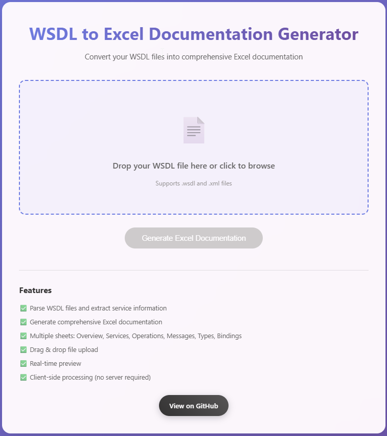

# 📊 WSDL to Excel Documentation Generator

Convert complex WSDL files into structured Excel documentation – directly in your browser.

> ⚙️ This project complements [wsdl-to-docx-converter](https://github.com/m3hr4nn/wsdl-to-docx-converter), providing a powerful toolkit for WSDL analysis and documentation.

---

## 🔍 Features

- ✅ Drag & drop or browse `.wsdl` and `.xml` files
- ✅ Parses services, operations, messages, types, bindings
- ✅ Creates a multi-sheet `.xlsx` Excel document
- ✅ Clean, responsive UI with real-time preview
- ✅ 100% client-side — no server or file upload

---

## 🖥 Live Web App

🔗 **Try it now**: [https://m3hr4nn.github.io/wsdl-to-xlsx-converter](https://m3hr4nn.github.io/wsdl-to-xlsx-converter)

---

## 📸 Screenshots

You can find examples in the [`screenshot/`](screenshot/) folder. Here's a sample:

  

---

## 🧪 Sample Input

This tool works with both simple and complex WSDL files.  
See [`complex_service.xml`](complex_service.xml) for an example input that demonstrates advanced structures.

---

## 📁 Output Structure

The generated Excel file includes the following sheets:

- **Overview** – General metadata
- **Services** – Service names and ports
- **Port Types** – Operation names and bindings
- **Operations** – Input/output/fault descriptions
- **Messages** – Message parts and types
- **Complex Types** – Custom data structures
- **Simple Types** – Enums and base restrictions
- **Bindings** – SOAP style and transport info

---

## ⚠️ Notes

- This is a **client-side web application**.  
  🚫 Nothing is uploaded or saved on a server.
- Your files stay secure in your browser during processing.
- Works entirely offline after loading once.

---

## 🤝 Contributing

Feel free to open issues or submit pull requests.  
Whether it’s a bug, feature request, or idea — all contributions are welcome!

---

## 📄 License

This project is licensed under the MIT License.  
See the [LICENSE](LICENSE) file for details.

---

## 👨‍💻 Author

Created by [@m3hr4nn](https://github.com/m3hr4nn)

---

